# Jak aplikować o grant OnBoard?
To będzie algorytm krok po kroku jak aplikować o grant HackClub (OnBoard) na płytki PCB.

## 0. Na co musisz być gotowy?

### Ograniczenia grantu:
- żeby zakup dało się sfinansować, należy być uczniem szkoły średniej,
- wartość grantu jest ograniczona do 100$,
- grant pokryje koszty płytki i dostawy, ale nie podatki i cła ze względu na skomplikowane procedury prawne. Dotyczy to szczególnie zakupów z metodą wysyłki innych niż w kategorii IOSS, gdzie klient może być zapytany o dalszą współpracę w przeprowadzaniu płatności.

### Dane osobowe
- W trakcie wysyłania formularza weryfikacyjnego (ani nigdzie indziej w internecie) pamiętaj o zakryciu danych, które do przeprowadzenia danego działania nie są na pierwszy rzut oka istotne.

## 1. Dołącz do Slacka
Jeśli jeszcze tego nie zrobiłeś, należy założyć konto na Slacku i dołączyć do HackClubu na Slacku. Nie ma tam żadnego procesu rekrutacyjnego, więc każdy może dołączyć w dowolnym momencie.

[Zrób to tutaj.](https://hackclub.com/slack/)

Po tym wejdź na kanał #onboard.

## 2. Upewnij się, że twoja płytka nie łamie zasad designu DRC
Żeby to sprawdzić, kliknij te przycisk w edytorze:

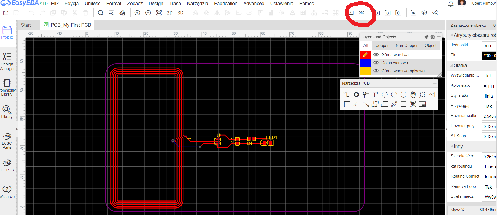

W tym projekcie powinny występować jedynie błędy na cewce/antenie. Uważaj na jeszcze jedną rzecz: pod cewką znajduje się jeszcze jedno połączenie, które się ukrywa. Możesz to zobaczyć, przesuwając cewkę w edytorze:

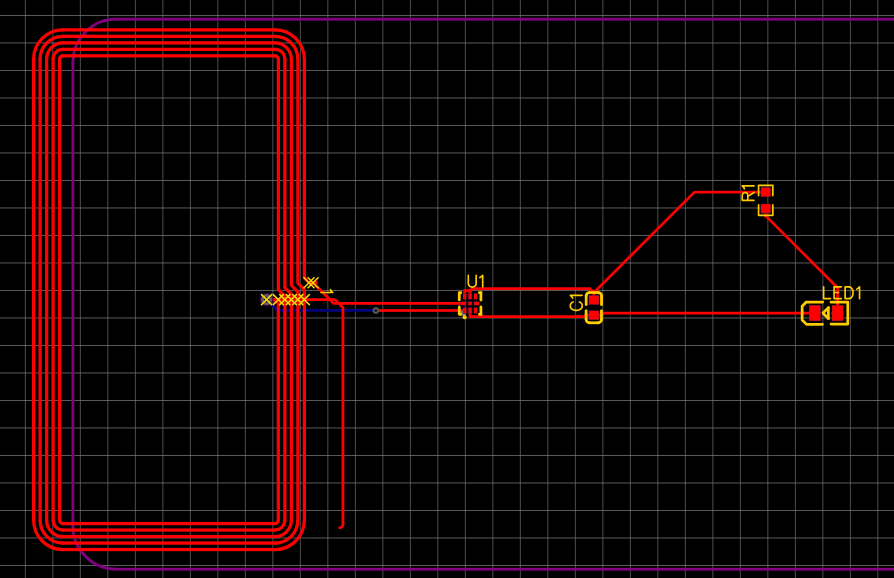

Po naprawieniu przesuń cewkę z powrotem na to samo miejsce.

## 3. Wygeneruj pliki Gerber i designu
Wróć na chwilę do schematu płytki (edytora z białym tłem). Wejdź w Plik > Źródło pliku, a w oknie kliknij "Pobierz".

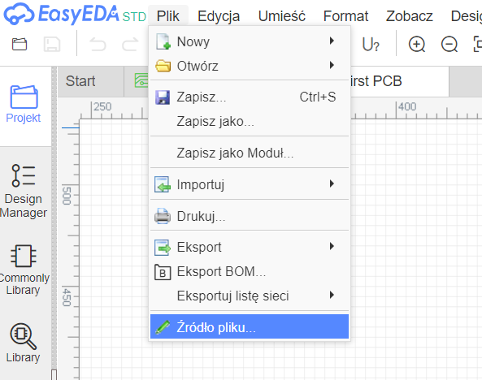

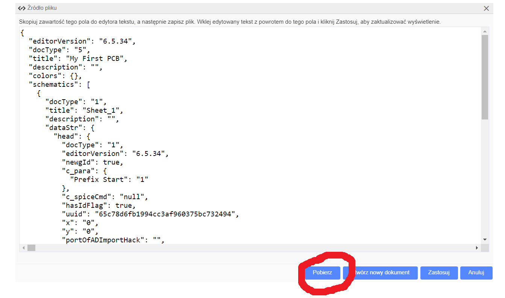

Zrób dokładnie to samo z designem płytki (czarny edytor). Również tutaj pobierz plik opisujący płytkę (w ten sam sposób).
Po tym wygeneruj pliki Gerber. To są pliki opisujące płytkę, potrzebne do jej zakupu.

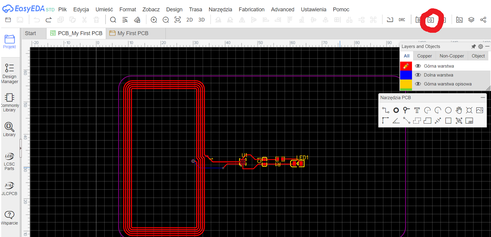

Po tym wchodzisz w opcję "No, generate Gerber", a następnie "Generate Gerber".

Wreszcie, wygeneruj do tego pliki BOM i pick and place. Są one dostępne pod przyciskami obok generowania pliku Gerber.

Żeby ukończyć ten krok, musisz posiadać:
- pliki Gerber (w formacie .zip)
- plik schematu (w formacie .json)
- plik płytki (w formacie .json)
- plik BOM (w formacie .csv)
- plik pozycji (pick and place, w formacie .csv)

## 4. Zrób screena z rozliczeń za zakup płytek

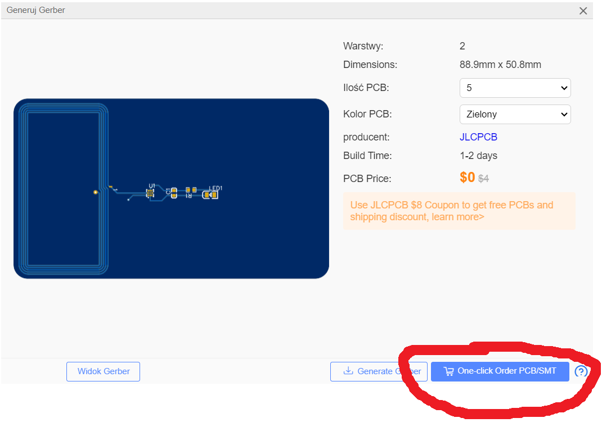

Następnie, dodaj wcześniej wygenerowane pliki Gerber. Dodaj ofertę do koszyka i wejdź na swój profil. **Pamiętaj, żeby zamówić 5 płytek - najmniejszą ich liczbę.**

Następnie, znajdź opcję PCB Assembly. Jest to oferta od JLCPCB na zamontowanie właściwych części na płytce. Wybierz *Assemble Top Side* i *PCBA type = Economic*. Możesz (ale nie musisz) ograniczać swojego PCB Assembly do 2 płytek, możesz jak najbardziej mieć te części zamontowane na 5 płytkach. Dalej wrzuczasz wcześniej wygenerowane pliki BOM i pick and place (CPL, po prawej strone najpewniej).

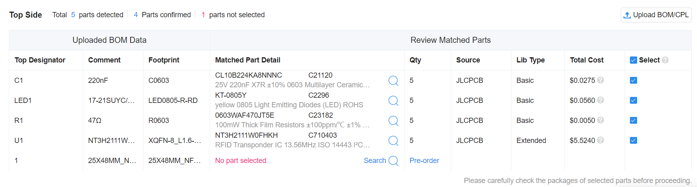

Cewka nie musi być oznaczona do wstawienia, czyli jeśli widzisz *No part selected* na cewce, to przechodzisz dalej po kliknięciu w odpowiedni przycisk i w *Do not place*.

W części nadania opisu produktu, wybierz Others/Others i wpisz NFC Business Card.

Po uzupełnieniu detali o PCB Assembly następnym krokiem jest udanie się do "Secure Checkout".

Wypełnij formularz własnymi danymi (nie jest to szczególnie istotne, ale precyzyjnie podaj adresy, bo na jego podstawie będą naliczane koszty + nic się nie zepsuje w trakcie zamównienia).

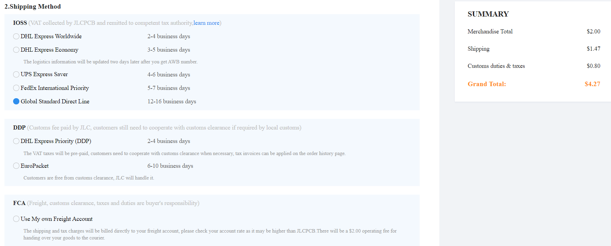

Wybierz metodę Global Standard Direct Line dla zminimalizowania kosztów. W przeciągu około 3 tygodni (12-16 dni roboczych) od zamównienia przesyłka będzie dostarczona.

Zanotuj, ile będzie kosztować płytka bez dostawy i z dostawą.

> **Zwróć uwagę na podatek i cło, które trzeba zapłacić z własnej kieszeni. Jeśli wybierzesz metodę wysyłki w kategorii IOSS, to wszystkie potrzebne opłaty powinny zostać poniesione już w trakcie wysyłki i zostaną pokryte przez grant, dzięki czemu nic nie będziesz musiał pokrywać z własnej kieszeni.**.

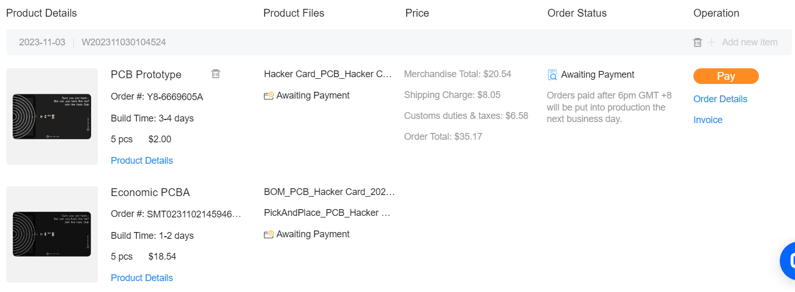
**To będzie screen, który wyślesz do HackClubu, przedstawiający koszty do pokrycia przez grant.**

Żeby zakończyć ten krok, będą ci potrzebne:
- screen przedstawiający płytki i koszty zamówienia,
- informacja o cenach płytki, o dostawie i wysokości cła.

## 5. Przygotuj się do dodania plików do repozytorium HackClub na GitHubie

[Wejdź na repozytorium OnBoard.](https://github.com/hackclub/OnBoard)

Tam znajdziesz opcję Fork. Fork to inaczej kopiowanie repozytoriów innych użytkowników na swoje konto, w celu uzyskania możliwości modyfikacji projektów innych osób. Końcowym etapem pracy nad forkiem jest tzw. *pull request*, czyli wysunięcie propozycji naniesienia zmian w oryginalnym projekcie innej osoby.

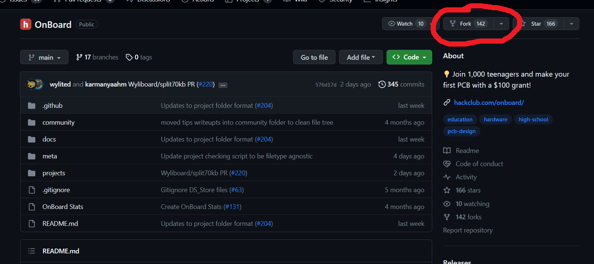

Po tym klonujesz forka (nie oryginalne repozytorium rzecz jasna) na swoje konto, gdzie możesz przeprowadzić zmiany. Robisz to przez zielony przycisk *Code* i otwarcie repozytorium przez GitHub Desktop.

## 6. Wypełnij pliki potrzebne do uzyskania grantu
Utwórz własny katalog w `projects` i zapełnij go wcześniej przygotowanymi plikami w taki sposób:

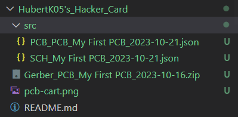

Co do pliku `README.md`, skopiuj plik `projects/!template/TEMPLATE.md` i wklej w swój katalog, zmieniając jego nazwę na `README.md`.
Ten skopiowany plik wypełnij swoimi danymi i przemyśleniami. Na pytanie "How much is it going to cost?" odpowiedz ceną płytki + ceną dostawy. Wklej https://jams.hackclub.com/jam/hacker-card jako link tutorialu.

**Pamiętaj, aby swoje zmiany scommitować i pushować. Możesz to zrobić poprzez GitHub Desktop.**

## 7. Otwórz pull requesta

Wejdź na GitHuba, na swoje sforkowane repozytorium, i znajdź ten przycisk:

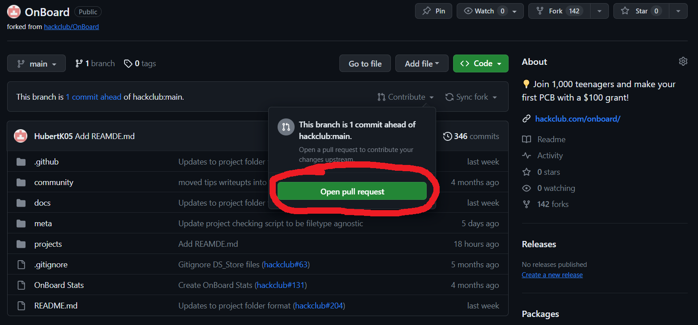

Wypełnij checklistę, która się pojawi, wstawiając znak `x` w nawiasy kwadratowe. Upewnij się, że zrobiłeś wszystkie podane kroki. Zostanie jeszcze jedna rzecz do zrobienia, czyli verification form. Ten formularz weryfikacyjny jest potrzebny po to, żeby organizacja upewniła się, że jesteś uczniem szkoły średniej i żeby wiedziała, gdzie trzeba dostarczyć przesyłkę. Jako dowód uczęszczania do szkoły wyślij zdjęcie swojej legitymacji szkolnej z datą ważności, nazwą szkoły i imieniem i nazwiskem, **z danymi przetłumaczonymi na angielski**.

> **Pamiętaj o tym, żeby zakryć dane, które nie są nikomu porzebne, jak np. PESEL. Tutaj nie skończy się to fatalnie, bo formularze nie są wysyłane osobom trzecim, ale na przyszłość taka informacja może się bardzo przydać.**

Możesz spojrzeć na treść pull requesta kilkająch przycisk *Preview* i jak wszystko się zgadza, wciśnij zielony przycisk "Create pull request".

## 8. Aplikacja ukończona!

Od tego momentu bądź na bieżąco na GitHubie (tam, gdzie twój pull request), mailu i na kanale #onboard na Slacku. Tam znajdziesz dalsze informacje datyczące zamawiania płytek. Płytki zamawiasz samemu, a Hack Club daje ci wirtualną kartę na 100$. Informacja o otrzymanym grancie pojawi się na mailu, ale nadal śledź, szczególnie przed zamówieniem, swojego pull requesta, gdzie mogą się znaleźć komentarze naprowdzające na właściwe przeprowadzenie procedury.

Zamów płytkę, oczywiście podając własne, prawdziwe dane do JLCPCB w trakcie *Secure Checkout*, czy też *Shipping Options*. Zamówienie powinno dotrzeć w przeciągu kilku tygodni i dużo będzie zależało od wybranej metody przesyłki.
