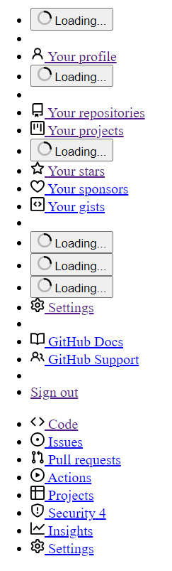
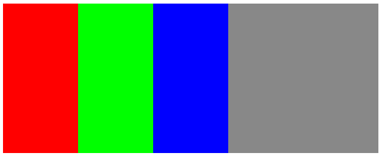
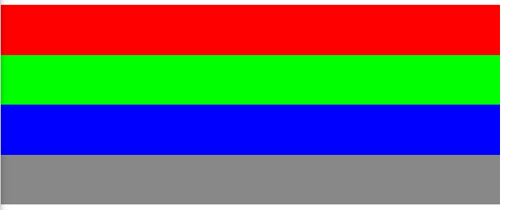

# CSS

CSS (Cascading Style Sheets) to narzędzie do implementowania wyglądu strony internetowej. To właśnie dzięki niemu strony mogą wyglądać dużo lepiej (albo dużo gorzej, jak ktoś bardzo pragnie). Różnica w wyglądzie między stronami z dobrze napisanym CSSem i bez niego jest oszałamiająca. Oczywiście, należy wygląd strony brać pod uwagę, ponieważ to właśnie on w dużej mierze decyduje, czy dana osoba będzie chciała zostać na stronie, czy też będzie chciała z niej jak najszybciej uciec.



Tak na przyklad wygląda strona GitHuba bez żadnego CSSa.

W tworzeniu stron internetowych dbanie o wygląd jest niemal równie istotne, jak o jej funkcjonalność. Dość często bywa tak, że słabo wyglądająca strona z szeroką funkcjonalnością jest prześcignięta w ilości użytkowników przez prostą, ale cieszącą oko stronę.

## Podstawowa składnia CSS

Plik CSS składa się z zestawów reguł przypisanych do selektorów. Selektor odnosi się do elementu HTML, jego identyfikatora bądź klasy. Zestaw reguł składa się z reguł (rzecz jasna) i decyduje o wyglądzie danego elementu, do którego odnosi się dany selektor.

Opiszmy składnię przykładowego zestawu reguł.

```css
button {
    border: none;
    border-radius: 100px;
    padding: 8px;
    margin-top: 4px;
}
```

W tym wypdaku selektorem jest `button`, co oznacza, że dany zestaw reguł będzie stosowany do każdego przycisku na stronie. W nawiasach klamrowych znajdują się reguły. Pojedyncza reguła zawiera nazwę własności i wartość, rozdzielone dwukropkiem i zakończone średnikiem. Tutaj jedną z reguł jest `border: none;`, który sugeruje, że przycisk nie będzie mieć żadnej widocznej obwódki.

## Proste reguły

### `color`
Określa kolor znajdującego się w elemencie tekstu. Wartość jest wyrażona w zapisie szesnastkowym. Zapis szesnastkowy koloru określa, jak intensywne są trzy barwy podstawowe (czerwony, zielony, niebieski w tej kolejności) składające się na opisywany kolor od 0 (00) do 255 (ff) włącznie.

PRZYKŁAD: Kolor czerwony jest opisany jako #ff0000, czyli czerwony o intensywności 255, zielony o intensywności 0 i niebieski o intensywności 0. Kolor o zapisie #09e69c (czerwony o intensywności 9, zielony o intensywności 230 i niebieski o intensywności 156) może być odebrany jako turkusowy.

### `background-color`
Określa kolor tła danego elementu.

### `border`
Określa styl obwódki danego elementu. Wartość `solid` oznacza jednolity kontur, `dotted` - kropkowany, `dashed` - kreskowany. Wartość `none` usuwa kontur z widoku, choć element nadal może być zaokrąglony przy użyciu własności `border-radius`.

### `border-width`
Określa grubość konturu.

### `border-radius`
Określa, jak mocno dany element ma zaokrąglone brzegi (w pikselach).

### `padding`
Określa, ile przestrzeni **wewnątrz** danego elementu pozostawić pustej (w pikselach). Podanie więcej niż jednej wartości pozwala ustalić, jak duży ten odstęp będzie z określonych stron. W tej regule można podać od 1 do 4 wartości.

### `margin`
Określa, ile przestrzeni **na zewnątrz** danego elementu pozostawić pustej (w pikselach). Wartość można podawać w ten sam sposób, jak w regule `padding`.

### `text-align`
Określa, gdzie umieścić tekst w danym elemencie. `start` (bądź `left`) wyrównują tekst do lewej, `center` wyśrodkowywuje tekst, `right` wyrównuje tekst do prawej, a `justify` wprowadza justowanie tekstu.

## Jak elementy są umieszczane?

Standardowy sposób umieszczania elementów jest poprzez dodawanie ich pod wcześniejszymi elementami - tak, jak biegnie na przykład lista, od góry do dołu. Ten sposób pozycjonowania elementów w CSS nosi nazwę `block` (i uzyskujemy do niego dostęp poprzez wpisane `display: block`). Oprócz tego sposobu można zastosować inne, wymienione niżej:

- `display: inline` umieszcza elementy tak, jak idą słowa w zdaniu - w tej samej linijce,
- `display: flex` przekształca element w tzw. flex container, w którym można łatwo umieścić elementy od lewej do prawej bądź od góry do dołu,
- `display: grid` sprawia, że wewnętrzne elementy układają się według siatki - mogą zajmować jej określone komórki.

Zarówno `flex`, jak i `grid` zawierają mnóstwo własnych opcji, które tutaj (w większości) nie będą omawiane. Jednak `flex` jest na tyle ważny, że nie można go pominąć w całości.

## `display: flex` - o co chodzi?

Przypuśćmy, że posiadasz element `<div class="container">` i ustawiasz na nim `display: flex`. W rezultacie otrzymasz flex container - czyli element, w którym podrzędne elementy będą umieszczane w porządku od lewej do prawej. Tamte elementy będą zajmować jednocześnie całą wysokość flex containera, o ile nie mają uprzednio ustawionej wysokości.

Poniższą zawartość wyświetli podany kod (Svelte):



```svelte
<div class="flex-container">
  <div class="one"></div>
  <div class="two"></div>
  <div class="three"></div>
</div>

<style>
  .flex-container {
    width: 500px;
    height: 200px;
    display: flex;
    background-color: #888888;
  }

  .one {
    width: 100px;
    background-color: #f00;
  }

  .two {
    width: 100px;
    background-color: #0f0;
  }

  .three {
    width: 100px;
    background-color: #00f;
  }
</style>
```

Poprzez `flex-direction` możemy wpłynąć na kierunek umieszczania kolejnych elementów. Po dodaniu reguły `flex-direction: column` do `.flex-container` i po zamianie reguły `width: 100px` na `height: 50px` na elementach mniejszych otrzymamy:



Flex container ma w sobie określoną oś główną (main axis) i poboczną (cross axis). Oś główna idzie w kierunku, w którym umiesczamy kolejne elementy. Domyślnie (kiedy nie ma określonej reguły `flex-direction`) oś główna jest ułożona poziomo. Oś poboczna jest osią prostopadłą do osi głównej.

Element, któremu nadano `display: flex` zawiera własne opcje, jak `align-items` i `justify-center`. `align-items` służy do określenia sposobu rozmieszczenia elementów po osi pobocznej. `justify-center` decyduje o ułożeniu elementów względem osi głównej. Te opcje można zastosować do łatwego wyśrodkowania elementu po obu osiach, poprzez zdefiniowanie flex containera następująco:

```css
.flex-container {
    display: flex;
    align-items: center;
    justify-content: center;
}
```

Oczywiście to są ograniczone informacje o CSS. [Więcej można znaleźć tutaj.](https://developer.mozilla.org/en-US/docs/Web/CSS)
