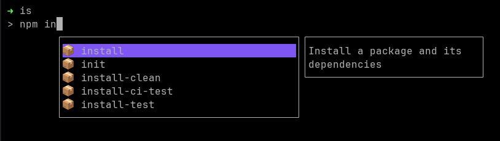

# Terminal

W programie *VSCode* dostępny po wciśnięciu kombinacji klawiszy *Ctrl + Shift + ~* lub po wejściu w zakładkę *Terminal > New Terminal*.

## Zatrzymanie programu konsolowego

Skrót *Ctrl + C* zakończy działanie programu konsolowego.
Aby skopiować zaznaczony myszką tekst z konsoli należy użyć kombinacji *Ctrl + Shift + C*. Analogowo dla innych skrótów systemowych które występją bez klawisza Shift, po jego dodaniu do kombinacji 

## Przeglądanie ostatnich poleceń

Używając strzałek góra i dół możemy przechodzić przez historię wywołanych poleceń. 

## Podpowiedzi poleceń

Gdy wpiszesz pierwsze litery polecenie klikając klawisz *Tab* włączysz autouzupełnianie, a następne kliknięcia będą przełączały pomiędzy sugestiami uzupełnienia.

### Oprogramowanie wspomagające

Aby przyśpieszyć korzystanie z poleceń dostępncyh w terminalu warto wybróbować program *Inshellisense*, mimikujące działanie *Intellisense* z edytorów kodu w terminalu. Dzięki temu możemy uzyskać podpowiedzi dostępncyh poleceń i ich argumentów.

#### Instalacja

Pod warunkiem, że mamy zainstalowany *NPM* (node package manager) możemy dodać narzędzie za pomocą polecenia:

```bash
npm install -g @microsoft/inshellisense
```

Następnie wywołując polecenie `is` (**I**nshelli**S**ense) przejdziemy do interaktywnej nakładki. Aby wyłączyć program wystarczy kliknąć *Ctrl + C* bądź wywołać polecenie `exit`.



## Inne przydatne skróty

- *Ctrl + L* = `clear` - czyści konsolę
- *Ctrl + D* - wylogowanie i zamknięcie konsoli
- *Ctrl + U* - czyści obecną linijkę konsoli
- *Ctrl + A* - przesuwa kursor na początek linijki
- *Ctrl + E* - przesuwa kursor na koniec linijki
- *Ctrl + Z* - wykonuje obecnie działające zadanie w tle, aby powrócić wpisz polecenie `fg`