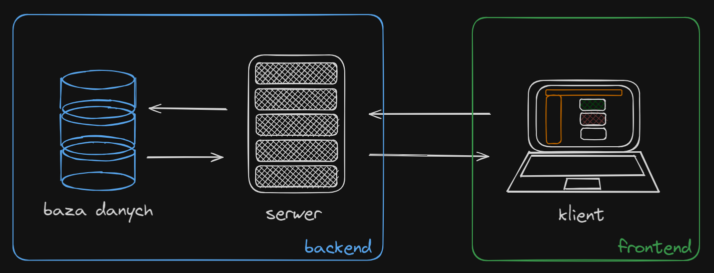
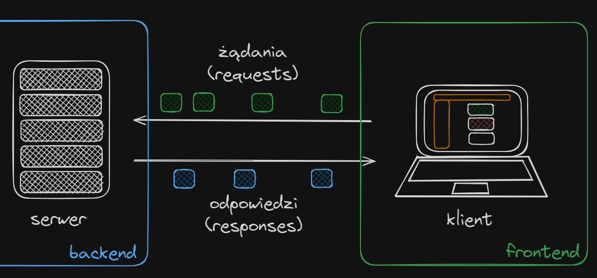
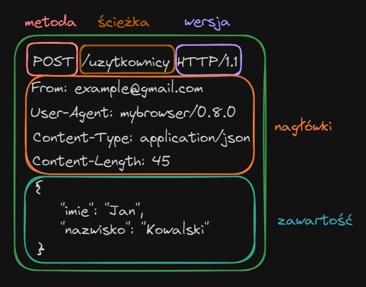
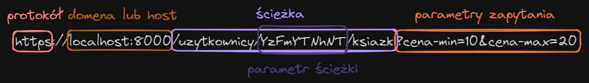
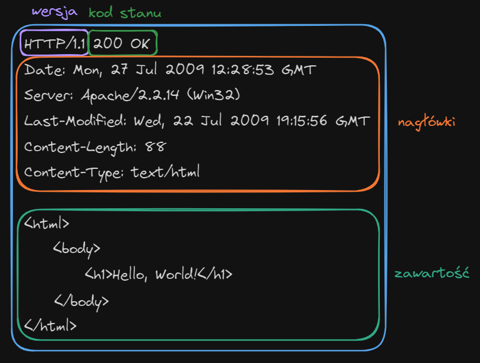

# Frontend, backend i HTTP

Dotychczas zajmowaliśmy się robieniem stron internetowych, na których były wyświetlane zdjęcia, kształty czy tekst. Dodatkowo, dodawaliśmy tam elementy związane z interakcją użytkownika, jak przyciski, a także zmienialiśmy wygląd (styl) strony.

Używaliśmy takich technologii jak HTML, CSS i JavaScript (Typescript), z frameworkiem Svelte. Te narzędzia pozwalają nam modyfikować zawartość strony, czyli to, co wyświetla się po wejściu na stronę przez przeglądarkę internetową. Wszystko na stronie, co użytkownik może zobaczyć lub odczuć, jest nazywane frontendem. Bardziej formalnie, kod frontendowy to kod po stronie klienta, czyli czegokolwiek, co łączy się z serwerem.

## Wprowadzenie do serwerów

Użycie samego frontendu ogranicza nam możliwość wykonania kodu jedynie do przeglądarki. Wszystkie strony internetowe, które zawierają w sobie np. system logowania, gdzie chcemy ukryć dane przed innymi ludźmi, potrzebują serwera, który będzie odpowiadał za bezpieczne przetworzenie danych. Kod znajdujący i wykonujący się po stronie serwera to kod backendowy.

Posiadanie serwera daje mnóstwo korzyści. Oprócz obsługi autoryzacji i uwierzytelniania:
- pozwala na przechowanie danych na stronie nawet po wyjściu z niej (tak, jak local storage),
- umożliwia zaawansowane filtrowanie i grupowanie danych w bazie danych,
- daje możliwość zaoszczędzenia na mocy obliczeniowej klienta poprzez przeniesienie trudnych obliczeniowo zadań na serwer.

Klient jest więc czymkolwiek, co korzysta z usług serwera. Serwerem zaś będzie cokolwiek, co będzie udostępniać klientowi zasoby.

### Każdy może mieć serwer u siebie w domu!

Serwery mogą kojarzyć się z gigantycznymi maszynami, szafami którymi są zapychane całe pomieszcenia. Nie ma wątpliwości, że żeby obsłużyć tysiące klientów naraz, potrzebna jest duża moc obliczeniowa. Ale oczywiście nie oznacza to, że przeciętny programista nie może zrobić własnego serwera w postaci programu na swoim komputerze. Właściwie, w świecie programowania backendowego umiejętność napisania własnego serwera jest podstawą podstaw.

Co ciekawe, to samo urządzenie może być i klientem, i serwerem jednocześnie. Dana maszyna jest serwerem określonej usługi, jeśli jest na niej uruchomiony program serwerowy.

## Jak frontend komunikuje się z backendem?

Żeby napisany program można było potraktować jako program serwerowy, musi on nasłuchiwać *żądań* na danym adresie IP i porcie, a także wysyłać *odpowiedzi* na *żądania*. Frontend wysyła na podany adres IP i port żądania, a następnie czeka na odpowiedź od serwera.

W świecie weboym:
- żądanie (ang. *request*) to rodzaj komunikatu przesyłanego od frontendu do backendu. Zawiera ono informacje dla serwera określające, co on ma z nim zrobić.
- odpowiedź (ang. *response*) to rodzaj komunikatu przesyłanego od backendu do frontendu. Zawiera on między innymi rezultat operacji programu serwerowego wykonanej po otrzymaniu żądania.

## Czym jest i jak działa HTTP - szczegółowy przebieg komunikacji

HTTP (Hypertext Transfer Protocol) to protokół (zbiór instrukcji, konwencji) sieciowy odpowiadający za przesył danych między frontendem i backendem. Cały opis protokołu jest dość skomplikowany i pełen licznych szczegółów: chętnych odsyłam do [RFC 9110](https://httpwg.org/specs/rfc9110.html). Tutaj zostaną podane najistotniejsze informacje.

> [!NOTE]
> RFC (Request for Comments - dosłownie: *prośba o komentarze*) to zbiór technicznych oraz organizacyjnych dokumentów mających formę memorandum związanych z Internetem oraz sieciami komputerowymi. Każdy z nich ma przypisany unikatowy numer identyfikacyjny, zwykle używany przy wszelkich odniesieniach.
>
> Tworząc aplikacje, zwykle programista nie ma doczynienia z obszernymi dokumentami RFC, ponieważ zajmują się one bardzo niskopoziomowymi kwestiami technologi, których używa, a nie dotyczną bezpośrednio logiki biznesowej. Warto jednak wiedzieć, że większość bibliotek czy frameworków uwzględnia wiele koceptów zaimplementowanych właśnie na podstawie RFC.

### Struktura żądania HTTP

#### Metoda HTTP

Metodą HTTP nazywa się w protokole rodzaj żądania określający, co dane żądanie zawiera i jak serwer powinien je interpretować. Dobrą praktyką jest stosowanie się do konwencji, która jest stosowana na całym świecie.

Do najczęściej używanych metod HTTP należą:
- `GET` do uzyskania odpowiednich danych,
- `POST` do utworzenia nowych zasobów na serwerze (jak np. utworzenie nowego użytkownika),
- `PUT` do aktualizacji zasobów na serwerze poprzez przekazanie serwerowi całej nowej zawartości zasobu,
- `PATCH` również do aktualizacji, tym razem poprzez przekazanie części zawartości,
- `DELETE` do usuwania określonych danych na serwerze.

Warto zaznaczyć, że żądania wykorzystujące metody `GET` i `DELETE` zwykle nie mają zawartości (body), choć teoretycznie mogą ją mieć.

#### Ścieżka + URI

URI (Uniform Resource Identifier) to adres określonego zasobu. Często mylony z adresem URL, ale w gruncie rzeczy każdy URL to URI (Zbiór URL jest podzbiorem zbioru URI).

URI składa się między innnymi z:
- nazwy domeny bądź adresem hosta, na który żądanie ma trafić,
- ścieżki, która jest informacją dla serwera, którą funkcję w środku włączyć.

Oprócz tego, URI może zawierać parametry, jak:
- parametry ścieżki (ang. *path parameters*), służące do przekazywania informacji serwerowi, którego konkretnie zasobu dotyczy dane żądanie po jego identyfikatorze,
- parametry zapytania (ang. *query parameters*), podawane w parach klucz-wartość, które służą głównie do przeszukiwania i filtrowania danych.

Przekazywanie danych przez parametry URI jest sposobem alternatywnym do przekazywania danych przez zawartość (body), zalecanym szczególnie do żądań z metodami `GET`. Pamiętajmy o tym, że te parametry są widoczne przez użytkowników zarówno w pasku adresu, jak i w historii przeglądania, dlatego przechowywanie tam wrażliwych danych takich jak haseł jest fatalnym pomysłem.

Do każdej ścieżki na serwerze może być przypisana dowolna liczba metod HTTP, ale wszytkie muszą być różne od siebie, np. nie można na serwerze zaimplementować `POST /users` i ponownie `POST /users`, ale można zaimplementować `GET /users` i `POST /users`.

#### Wersja protokołu HTTP

HTTP to protokół, który cały czas się rozwija. W tym przykładzie pokazane jest żądanie z HTTP w wersji 1.1 (HTTP/1.1), które istnieje od roku 1997. Obecnie, większość połączeń w sieci odbywa się poprzez HTTP/2.

Główne różnice między HTTP/1.1 a HTTP/2 to:
- większa efektywność przesyłu danych w HTTP/2,
- sposób zapisu danych: w HTTP/1.1 żądania i odpowiedzi są tekstowe (dlatego są łatwe do odczytu i wytłumaczenia), natomiast w HTTP/2 te komunikaty są wysyłane w formie binarnej, interpretowanej przez przeglądarki i serwer.

Poza tym przeważająca większość zasad rządzących protokołem nie zmienia się.

#### Nagłówki HTTP

Nagłówki (ang. *headers*) to zbiór danych, definiowany przez protokół i sterujący zachowaniem serwera, który dane żądanie odbiera. Jest ich bardzo dużo i nie ma potrzeby ich zapamiętywać.

#### Zawartość żądania

Zawartość (body) to zapisywane w tekstowym formacie zdefiniowanym w nagłówku `Content-Type` dane, jakie są przesyłane w żądaniu. Najczęściej spotykany format zawartości to `JSON`. `JSON` to jest nic innego, jak sposób reprezentacji danych.

### Struktura odpowiedzi

#### Kod stanu

Kod stanu (ang. *status code*) to liczbowo-tekstowy kod oznaczający rezultat zrealizowania żądania przez serwer. Jest to główna informacja interpretowana przez przeglądarki dotycząca żądania.

Kody stanu dzielą się na 5 kategorii, na podstawie przedziału liczbowego, do którego należą:
- 100-199 - kody informacyjne,
- 200-299 - kody sukcesu,
- 300-399 - kody przekierowania,
- 400-499 - kody błędu po stronie klienta,
- 500-599 - kody błędu po stronie serwera.

Warto stosować się do konwencji używania odpowiednich kodów stanu, ponieważ zminimalizuje to problemy w interakcji z frontendem, innymi technologiami, a także poprawi SEO, dzięki czemu strona wyświetli się wyżej w wyszukiwarce.

##### Najważniejsze kody stanu

- `200 OK` - najczęściej spotykany kod sukcesu. Podajemy go, jeśli realizacja żądania zakończyła się sukcesem.
- `400 Bad Request` - żądanie ma nieprawidłowy format, lub dane w nim nie są zgodne ze stanem serwera.
- `401 Unauthorized` - klient próbuje uzyskać dane ze ścieżki URI zabezpieczonej autoryzacją podczas gdy on sam nie jest autoryzowany.
- `403 Forbidden` - serwer jest w stanie wskazać, kim jest klient, ale nie zezwala na dostęp do danych.
- `404 Not Found` - zasobu lub ścieżki URI nie znaleziono.
- `405 Method Not Allowed` - dla danej ścieżki URI na serwerze nie ma zdefiniowanej metody HTTP, która miałaby obsłużyć żądanie.
- `429 Too Many Requests` - serwer otrzymuje za dużo żądań.
- `500 Internal Server Error` - serwer nie jest w stanie zrealizować żądania, ponieważ w jego programie jest błąd.

#### Nagłówki HTTP + zawartość

Nagłówki i zawartość znajdują się zarówno w żądaniu, jak i w odpowiedzi. Warto jednak zwrócić uwagę na to, że niektóre nagłówki dotyczą tylko żądania, inne dotyczą tylko odpowiedzi, a pozostałe dotyczą obu komunikatów.

## Koniec

I to by było na tyle!

Dodatkowe informacje na temat HTTP:
- [MDN web docs - ogólne informacje](https://developer.mozilla.org/en-US/docs/Web/HTTP)
- [MDN web docs - metody HTTP](https://developer.mozilla.org/en-US/docs/Web/HTTP/Methods)
- [MDN web docs - kody stanu](https://developer.mozilla.org/en-US/docs/Web/HTTP/Status)
- [RFC 9110 - HTTP](https://httpwg.org/specs/rfc9110.html)
