# Minecraft development

## Spis treści
- [Minecraft development](#minecraft-development)
  - [Spis treści](#spis-treści)
  - [Serwer](#serwer)
    - [Silnik](#silnik)
      - [Vanilla](#vanilla)
      - [CraftBukkit](#craftbukkit)
      - [Spigot](#spigot)
      - [Paper (nasz wybór)](#paper-nasz-wybór)
      - [Forge](#forge)
  - [IDE](#ide)
    - [Instalacja](#instalacja)
    - [Rozszerzenie InteliJ](#rozszerzenie-intelij)
    - [Ustawienie projektu](#ustawienie-projektu)
      - [Nowy plugin Minecraft](#nowy-plugin-minecraft)
      - [Instalacja Java Development Kit](#instalacja-java-development-kit)
      - [Konwersja do Kotlina](#konwersja-do-kotlina)
      - [Gradle](#gradle)
  - [Launcher Minecraft](#launcher-minecraft)
    - [Portablemc](#portablemc)
      - [Instalacja](#instalacja-1)
        - [Windows](#windows)
        - [Linux](#linux)
      - [Pobranie Minecrafta z mod loaderem Fabric](#pobranie-minecrafta-z-mod-loaderem-fabric)
  - [Mod manager](#mod-manager)
    - [Ferium](#ferium)
      - [Instalacja](#instalacja-2)
        - [Windows](#windows-1)
      - [Pobranie modyfikacji](#pobranie-modyfikacji)
  - [PATH](#path)
    - [GUI](#gui)
      - [Przykład](#przykład)
  - [PaperMake](#papermake)
    - [Instalacja](#instalacja-3)
    - [Użycie](#użycie)
  - [Dokumentacja Bukkit](#dokumentacja-bukkit)
  - [Windows](#windows-2)
## Serwer

Serwery są nieodłączym elementem Minecrafta. Dzięki nim możemy cieszyć się z gry w czasie rzeczywistym z innymi graczami. To one również umożliwiają nam na urozmaicanie rozgrywki za pomocą pluginów.

### Silnik

Istnieje wiele silników, na których można uruchomić serwer *Minecraft*. Każdy z nich ma swoje wady i zalety.

#### Vanilla

[Java Edition](https://www.minecraft.net/pl-pl/download/server)

[Bedrock Edition](https://www.minecraft.net/en-us/download/server/bedrock)

Podstawowy silnik. Nie obsługuje modów ani pluginów. Wydawany przez Mojang z każdą wersją gry Minecraft.

#### CraftBukkit

[CraftBukkit](https://getbukkit.org/download/craftbukkit)

Pierwszy popularny silnik. 

#### Spigot

[Spigot](https://getbukkit.org/download/spigot)

Silnik bazujący na CraftBukkit. Przez długi czas najpopularniejszy silnik.

#### Paper (nasz wybór)

[Paper](https://papermc.io/)

Silnik bazujący na Spigot, skupiający się na wydajności. Obsługuje pluginy. 

#### Forge

[Forge](https://files.minecraftforge.net/net/minecraftforge/forge/)

Silnik stworzony do rozszerzania silnika vanilla po przez modyfikacje.

## IDE

Rekomendowane narzędzie IDE do pracy z pluginami i modami.

> Praca nad pluginami *Minecraft* w programie *Visual Studio Code* jest znacznie trudniejsza, dlatego rekomendowane jest użycie *JetBrains InteliJ IDEA*.
>  
### Instalacja

[JetBrains InteliJ IDEA website](https://www.jetbrains.com/idea/)

[Windows ⬇️](https://www.jetbrains.com/idea/download/download-thanks.html?platform=windows&code=IIC)

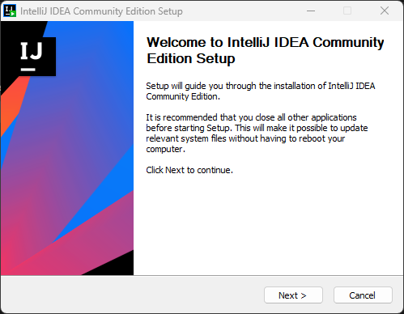

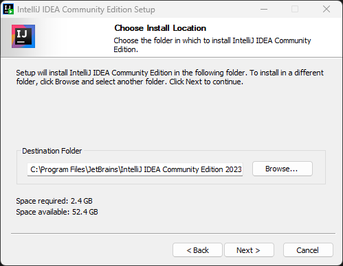

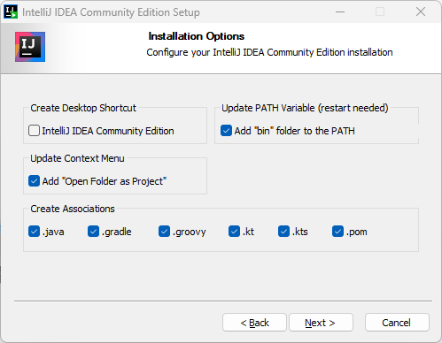

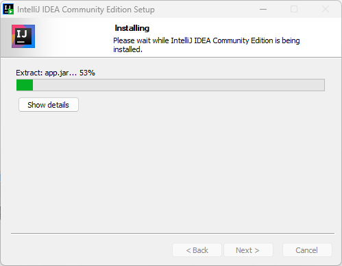

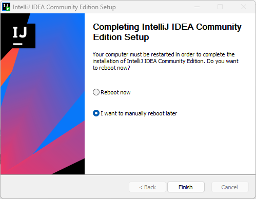

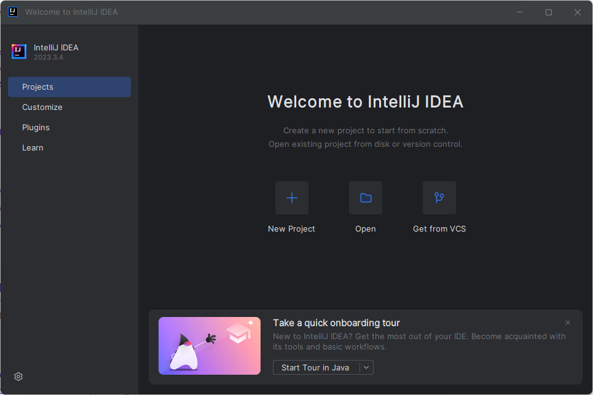

### Rozszerzenie InteliJ

Rozszerzenie *Minecraft Development* znacznie ułatwia pisanie pluginów i modów.


Po zainstalowaniu rozszerzenia wymagane jest zrestartowanie programu (Restart IDE).

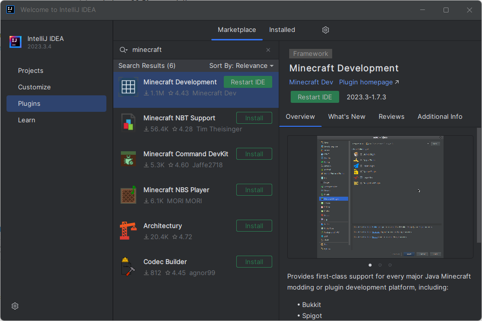

### Ustawienie projektu

#### Nowy plugin Minecraft

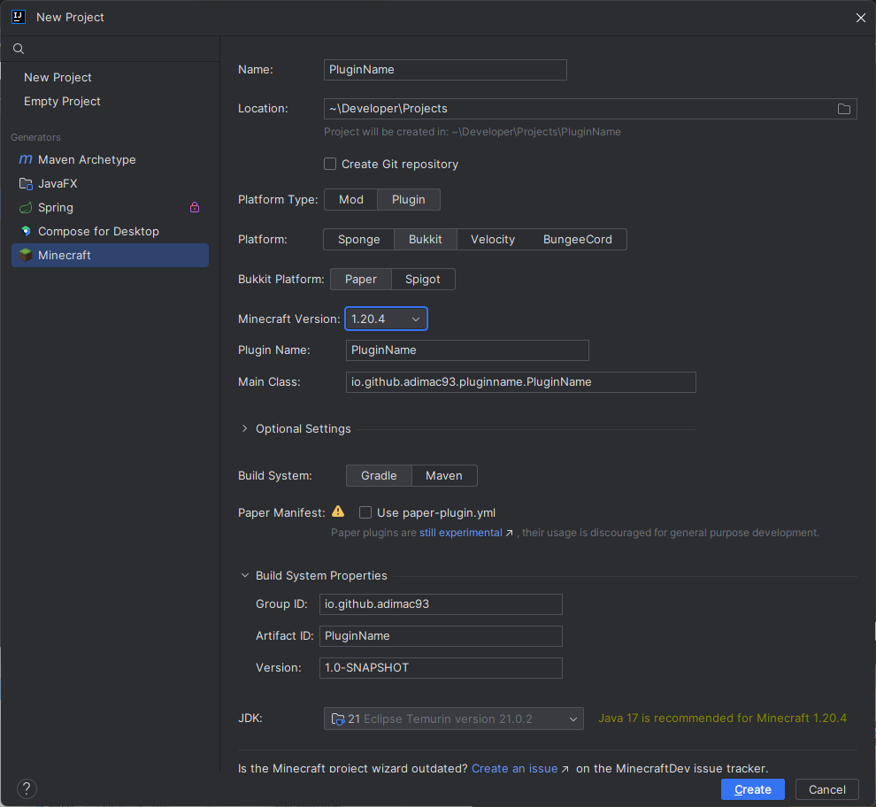

#### Instalacja Java Development Kit

Java Development Kit (JDK) to zestaw narzędzi i bibliotek programistycznych, który umożliwia pisanie, kompilowanie i uruchamianie programów napisanych w językach takich jak Java czy Kotlin. Zawiera między innymi kompilator javac, wirtualną maszynę Java (JVM).

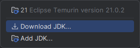

Podaną lokalizację instalacji należy dodać do PATH, aby móc korzystać z narzędzi Java poza IDE.


#### Konwersja do Kotlina

W tej chwili nasz projekt używa Javy. Ale my chcemy używać Kotlina! Dlatego trzeba wykonać **konwersję**.
Do tego używa się opcji *Convert Java File to Kotlin File* w menu *Code*.

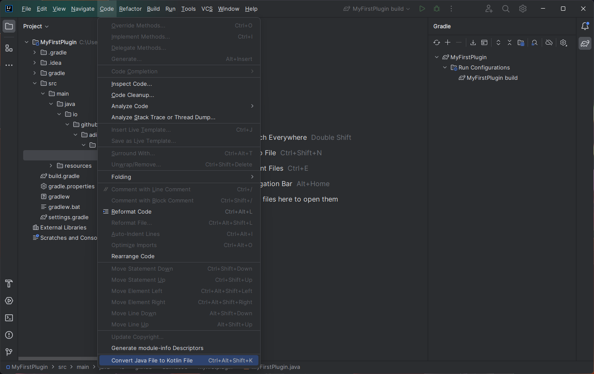

Powinno pojawić się okienko mówiące że Kotlin nie jest skonfigurowamy. Wybieramy opcję *OK, Configure Kotlin In The Project* aby to zrobić.

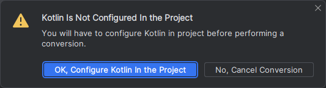

Wybieramy konwersję wszystkich modułów projektu (*All Modules*)

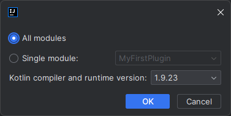

Po zakończeniu tego procesu pliki z Javą powinny się automagicznie zamienić na pliki z Kotlinem.

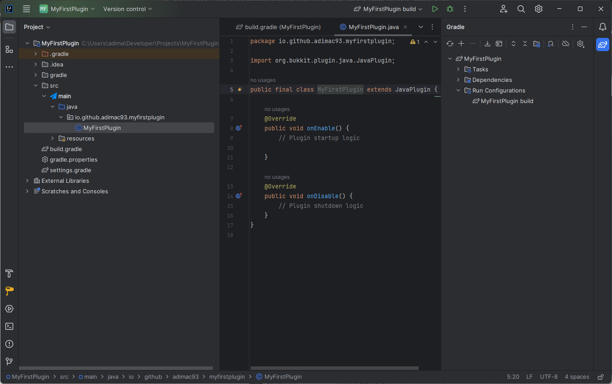
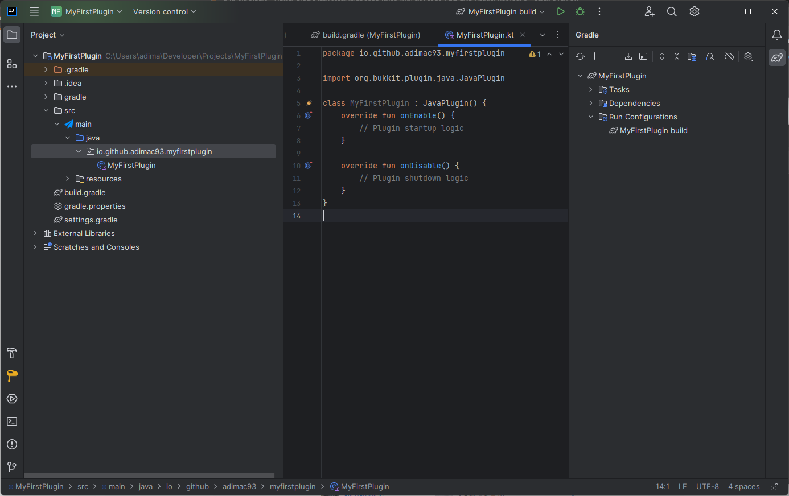

#### Gradle

*build.gradle*

```groovy
// Pluginy Gradle
plugins {
    id 'java'
    id 'idea' // +
    id 'org.jetbrains.kotlin.jvm'
    id 'com.rikonardo.papermake' version '1.0.6'
}

group = 'io.github.adimac93'
version = '1.0-SNAPSHOT'

repositories {
    mavenCentral()
    maven {
        name = "papermc-repo"
        url = "https://repo.papermc.io/repository/maven-public/"
    }
    maven {
        name = "sonatype"
        url = "https://oss.sonatype.org/content/groups/public/"
    }
}

dependencies {
    compileOnly "io.papermc.paper:paper-api:1.20.4-R0.1-SNAPSHOT"
    implementation "org.jetbrains.kotlin:kotlin-stdlib"
}

// Docelowa wersja Java, musi być >= 17
def targetJavaVersion = 17
java {
    def javaVersion = JavaVersion.toVersion(targetJavaVersion)
    if (JavaVersion.current() < javaVersion) {
        toolchain.languageVersion = JavaLanguageVersion.of(targetJavaVersion)
    }
}

tasks.withType(JavaCompile).configureEach {
    options.encoding = 'UTF-8'

    if (targetJavaVersion >= 10 || JavaVersion.current().isJava10Compatible()) {
        options.release.set(targetJavaVersion)
    }
}

processResources {
    def props = [version: version]
    inputs.properties props
    filteringCharset 'UTF-8'
    filesMatching('plugin.yml') {
        expand props
    }
}
kotlin {
    // Wersja Java używana przez Kotlin. Powinna zgadzać się z tą powyżej
    jvmToolchain(17)
}

// + Dopisujemy, aby uzyskać dostęp do dokumentacji bezpośrednio z IDE
idea {
    module {
        downloadJavadoc = true
    }
}
```

## Launcher Minecraft

Istnieje wiele rodzajów launcherów gry Minecraft, które różnią się interfejsem graficznym i możliwościami takimi jak ułatwione wgrywanie pluginów i modów lub wymaganie zakupienia gry bądź nie.

### Portablemc

Portablemc to lekki launcher CLI w wersji zarówno non-premium jak i premium, służący do łatwej instalacji mod loaderów.

[Portablemc](https://pypi.org/project/portablemc/)

#### Instalacja

Za pomocą menadżera pakietów *pip* pobieramy najnowszą wersję launchera.

##### Windows

```bash
pip install --user portablemc[certifi]
```

##### Linux

```bash
pip install --user portablemc
```

#### Pobranie Minecrafta z mod loaderem Fabric

Po wpisaniu polecenia pobierze się najnowsza wersja minecrafta z mod loaderem Fabric.


```bash
portablemc start fabric: --dry
```
> Wywołanie polecenia bez flagi `--dry` spowoduje uruchomienie gry.

## Mod manager

Aby załadować modyfikacje, bądź całe paczki modyfikacji często używa się do tego aplikacji takich jak CurseForge czy Modrinth. Istenią również wersje CLI do obsługi całego procesu instalacji.

### Ferium

[Ferium](https://github.com/gorilla-devs/ferium)

#### Instalacja

##### Windows

```bash
winget install GorillaDevs.Ferium
```
#### Pobranie modyfikacji

Utworzenie profilu o nazwie *development* na mod loaderze *Fabric* z najnowszą wersją gry.

Można to zrobić na dwa sposoby:

podając bezpośrednio wszystkie parametry
```bash
ferium profile create --name development --mod-loader fabric --game-version latest
```

lub używając interaktywnego interfejsu.
```bash
ferium profile create
```

Następnie dodajemy modyfikację Sodium, optymalizującą grę.

```bash
ferium add sodium
```

Na koniec pobieramy dodaną modyfikację.

```bash
ferium upgrade
```

## PATH

```sh
$env:path >> path-backup.txt
```

```sh
setx PATH "$env:path;C:\Users\<username>\.jdks\<jdk-version>\bin"
```

```sh
SUCCESS: Specified value was saved.
```

### GUI

W ustawieniach Windows należy wyszukać *zmienne środowiskowe*, bądź klinknąć prawym przyciskiem myszy na *Mój komputer > Właściwości > Zaawansowane*.

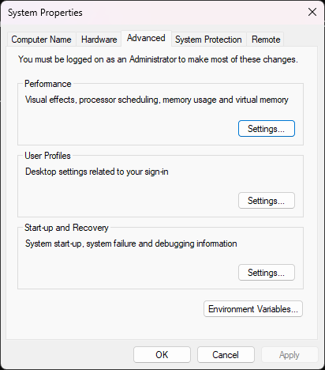

Edytujemy wartość *Path* ze zmiennych użytkownika (tabela na górze).

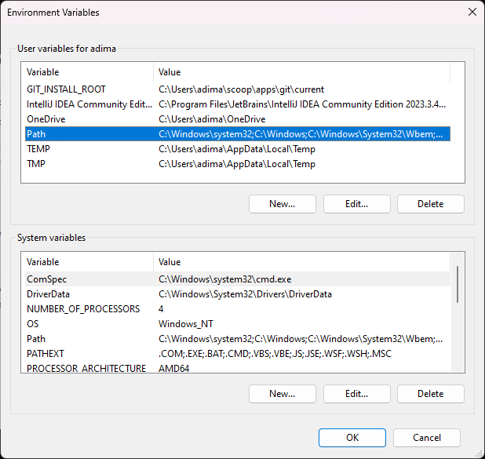

Dodajemy ścierzkę do folderu z plikami wykonywalnymi, takimi jak *.exe*, *.bat*, *.py* i podobne.

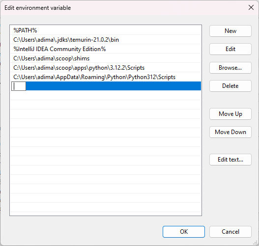

#### Przykład

Aby dodać narzędzia JDK pobrane w InteliJ do PATH należy dodać ścieżkę *C:\Users\<username>\.jdks\<jdk-version>\bin*
TODO

## PaperMake

[PaperMake](https://github.com/Rikonardo/PaperMake)

*PapmerMake* to plugin *Gradle* ułatwiający testowanie pluginów *Minecraft*. Dodaje kilka przydatnych komend do gry oraz sam włącza serwer deweloperski [*Paper*](https://papermc.io/). Dzięki niemu za każdym razem kiedy wykonuje się akcja budowania, serwer przeładowuje się z najnowszą wersją pluginu *Minecraft*.

### Instalacja

Dodajemy `id "com.rikonardo.papermake" version "1.0.6"` na koniec listy pluginów w pliku *build.gradle*.

```groovy
plugins {
    // ...
    id "com.rikonardo.papermake" version "1.0.6"
}
```

Po zmianie pliku *build.gradle* należy zastosować zmiany, odświerzając *Gradle* 🔄.


### Użycie

W projekcie powinny znajdować się pliki *gradle.sh* oraz *gradle.bat*. Odpowiednio dla systemów UNIX i Windows.

Wywołując polecenie *gradlew*, mamy dostęp do komend, które zdefiniowane zostały przez pluginy *Gradle*. Plugin *PaperMake* dodaje polecenie *devServer*, które automatycznie tworzy serwer deweloperski *Paper* w `build/papermake/run` i uruchamia go. Domyślnie serwer uruchomi się na adresie *localhost:25565*.

```bash
./gradlew devServer
```

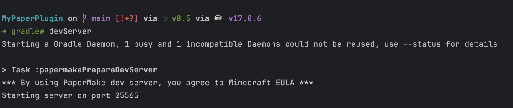

## Dokumentacja Bukkit

[Bukkit API docs](https://hub.spigotmc.org/javadocs/bukkit/)

[Bukkit Wiki](https://bukkit.fandom.com/wiki/Main_Page)

## Windows

*Win + R*


